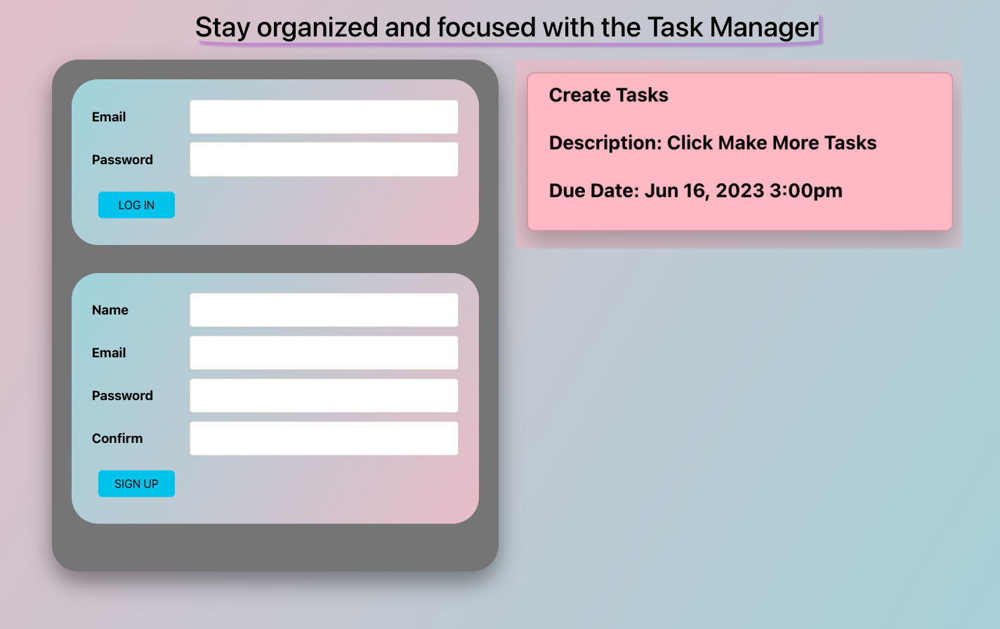
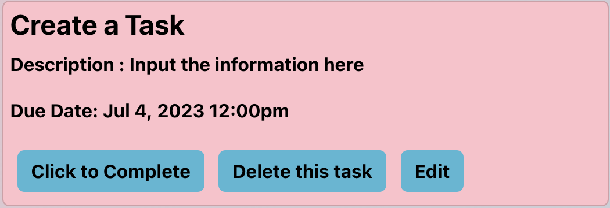

The TaskApp

The TaskApp is an application which manages a user's to-do-list. You can give your to-do a title, description and due date as well as edit, delete and mark complete.

Screenshots

Tech

This application uses MongoDB, Express, React and Nodejs.

Getting Started

https://task-app-ga.herokuapp.com/   --here is the link to the application

Future Enhancements

1. A list of completed tasks
2. Total time to complete each task
3. Average time to complete each task
4. Total tasks remaining
5. Visuals to represent this data